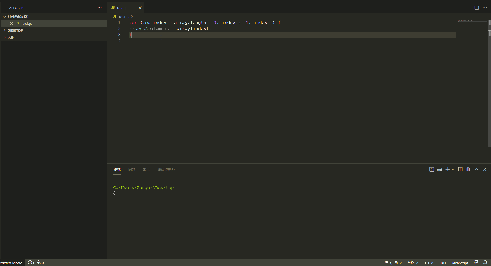
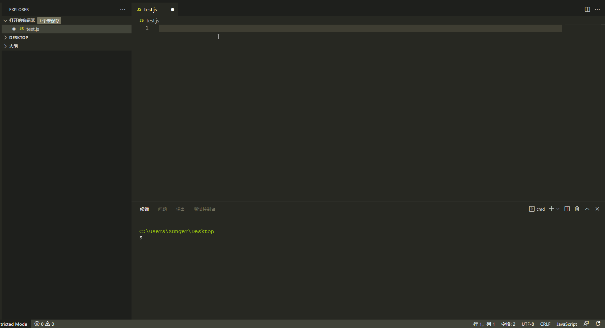
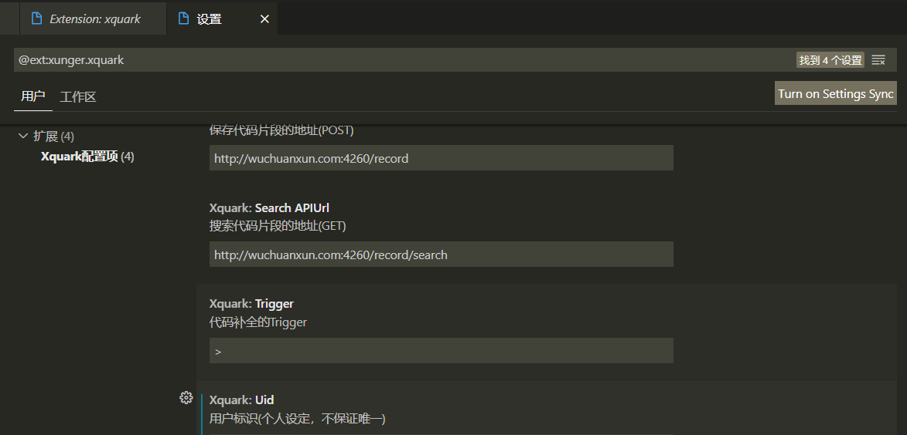

# xquark

此插件可以保存和搜索代码片段，针对任何文件，不同文件类型代码片段是分开的

也就是说：python文件中保存的python代码片段只能在python文件中使用，vue文件保存的代码片段只能在vue文件中使用


保存预览




补全预览




配置：

`xquark.saveAPIUrl` : 代码保存的地址，使用POST方法，默认已经提供了一个接口，可自己实现该接口

传递的参数如下：

```json
{
    "key": "用户输入的说明文本",
    "code": "选中的代码",
    "uid": "用户的标识",
    "type": "文件的扩展名"
}
```


`xquark.searchAPIUrl`: 代码搜索的地址，使用GET方法，默认已经提供了一个接口，可自己实现该接口

传递的参数如下：

```json
{
    "content": "搜索匹配的文本，也就是搜索词之前的文本",
    "uid": "用户的标识",
    "type": "文件的扩展名"
}
```


`xquark.uid`: 用户的标识，不需要注册用户，每个用户设置一个自己专有的用户ID，使得自己的代码片段可以与别人的区分




`xquark.trigger`: 代码搜索的触发字符


<a target="_blank" href="https://icons8.com/icon/43988/code">Code</a> icon by <a target="_blank" href="https://icons8.com">Icons8</a>
